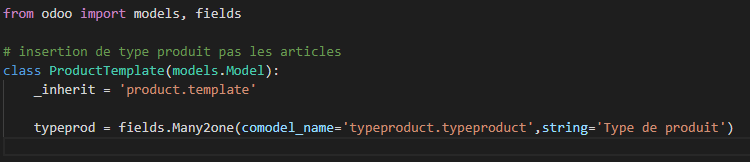

# Développement projet ODOO: Bieraubeurre

Vous pouvez accéder au [code source](https://github.com/pierre-roman/Projet-Odoo-Type-Product) du module.

#

## Modifier le module produit en rajoutant un champs « type » 

#

Le but était d'ajouter notre champ type dans l'onglet du produit

Pour faire cette modification nous avons crée notre propre module "product_type" puis nous avons crée une classe ProductTemplate dans laquelle on effectue un lien vers la template du module product d'Odoo.

On a ensuite initialisé une variable contenant un tableau de type de produit.

#

Pour l'affichage on crée un record dans lequel on appel la variable de notre models.py, on place ensuite le tout dans note template XML.

## Le champs type pointera vers une table qui fournira plusieurs type

#

## Créer une interface dans Odoo qui permet de rajouter les types de de produi

#

## Modifier le report du devis et de la facturation pour rajouter le type de produit dans les lignes de produits

#

## Créer un report qui permet de donner un topos sur les ventes des produit en les classant par type

#