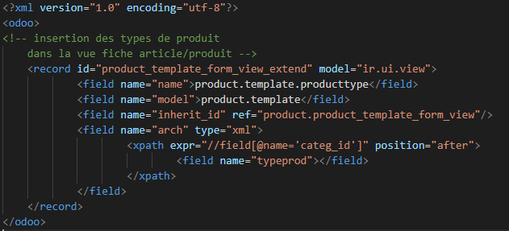
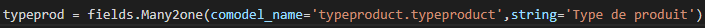
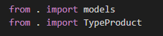
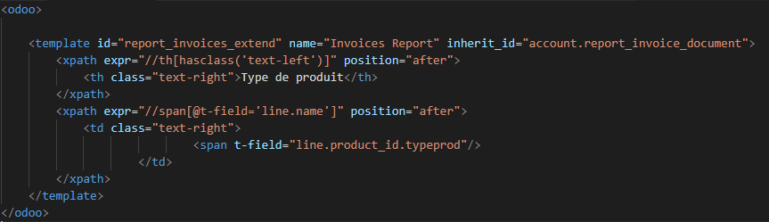

# Développement projet ODOO: Bieraubeurre

Vous pouvez accéder au [code source](https://github.com/pierre-roman/Projet-Odoo-Type-Product) du module.

#

## Modifier le module produit en rajoutant un champs « type » 

#

Le but était d'ajouter notre champ type dans l'onglet du produit

Pour faire cette modification nous avons créé notre propre module "product_type" puis nous avons créé une classe TypeProduct qui permet de définir le nom de nos types.

Ainsi que la classe ProductTemplate dans laquelle on effectue un lien vers la template du module product d'Odoo.

Pour l'affichage on crée un record dans lequel on appelle la variable de notre models.py, on place ensuite le tout dans note template XML.

## Le champs type pointera vers une table qui fournira plusieurs type

#

Dans la classe ProductTemplate, nous avons effectué la connexion avec la table à l'aide de la fonction Many2one.

## Créer une interface dans Odoo qui permet de rajouter les types de de produits

#

Nous avons créé notre propre module et nous l'avons connecté avec la database afin de créer des types de produits.

# 

On peut accéder à l'interface depuis le menu de Odoo ainsi que depuis l'interface du produit.

Et voilà le menu qui nous permet de créer des nouveaux types de produit.

Dans un premier temps nous avons créé une classe

Puis nous avons créé la view XML

Par la suite nous avons import la template dans le init de models

Enfin nous avons chargé la view ainsi que le fichier de sécurité .csv

## Modifier le report du devis et de la facturation pour rajouter le type de produit dans les lignes de produits

#

Dans un premier temps nous avons modifié le report du devis

Nous avons créé une template XML qui s'injecte directement dans le report_saleorder_document

Puis nous avons modifié le report de facture

Nous avons créé une templmate XMl qui s'injecte directement dans le report_invoice_document

## Créer un report qui permet de donner un topos sur les ventes des produit en les classant par type

#

Nous n'avons pas pu arriver au bout de cette tache malheureusement...