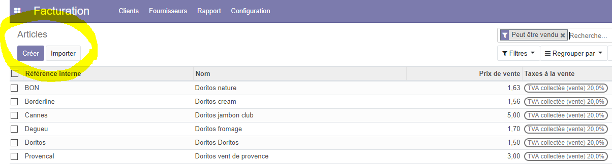
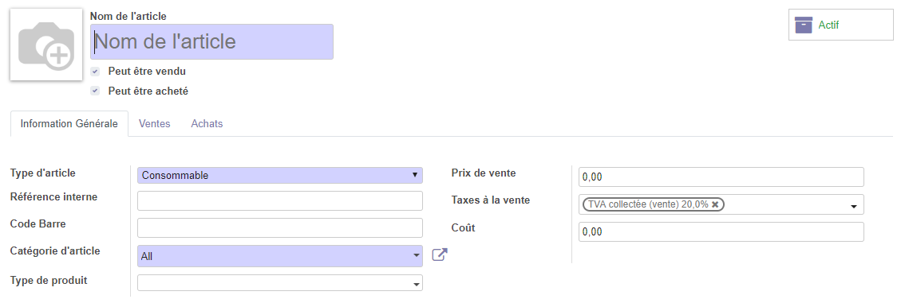
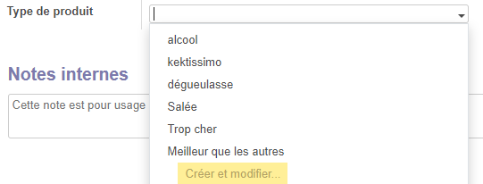
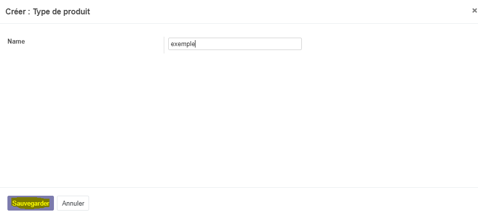
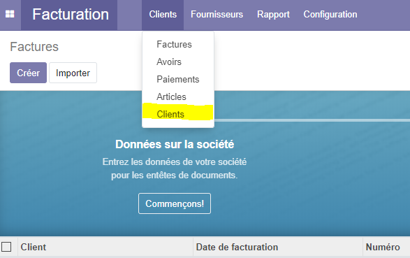
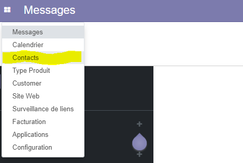
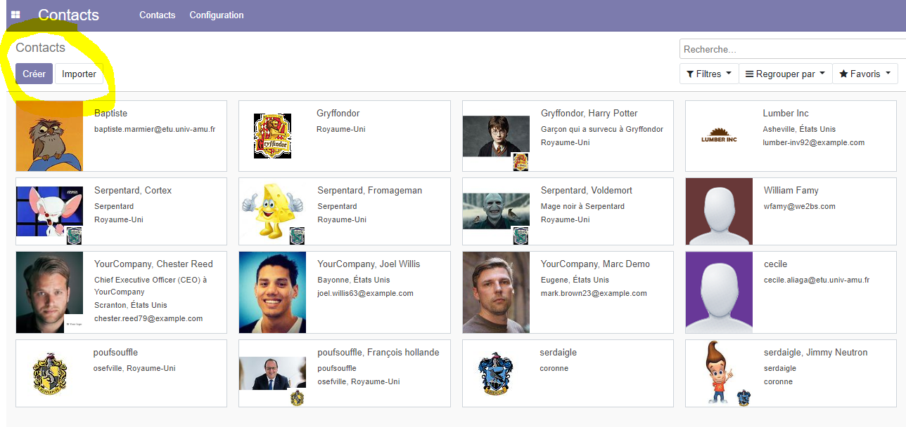
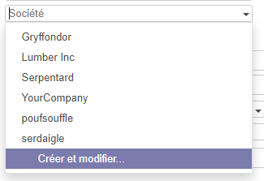
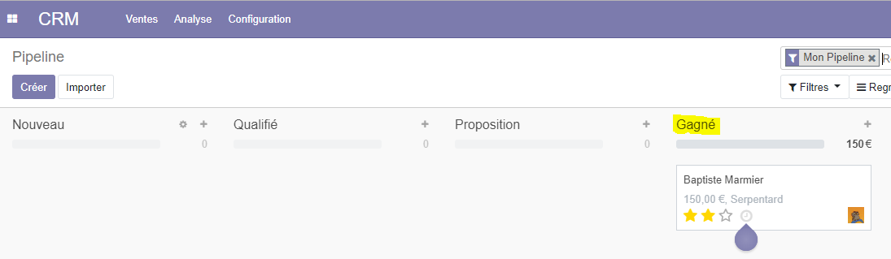
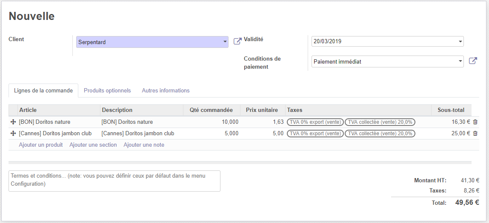

# Utilisation projet ODOO: Bieraubeurre

Vous pouvez accéder au [code source](https://github.com/RexT2507/product_type) du module.

#

## Créer des produits avec le nouveaux type

#

Pour la création d'un article, il faut se rendre dans l'écran facturation puis dans l'onglet client et enfin sur article.

Une fois que l'on est dans l'écran Articles on peut voir une liste des articles déjà créer ainsi qu'un menu, nous donnant la possibilité de créer ou d'importer des articles.

Prenons un exemple, nous voulons créer un nouvel article, on clique donc sur "créer", on arrive sur un écran de création de notre nouvel article.

On peut remarquer l'ajout du champ "Mes types de produits" par le module product_type que nous avons réalisé.

Il vous suffit de saisir le nom et les autres informations de votre article et de sauvegarder, l'article apparaîtra dans la liste.

#

## Créer un nouveau type

#

On peut accèder à l'interface de création depuis l'interface de modification/création de l'article ou du menu principal d'Odoo.

Pour créer un nouveau type, il suffit de saisir le nom du nouveau type et de sauvegarder.

Si on prend l'exemple de tout à l'heure en affichant la liste des types, on remarque bien que "exemple" a été ajouté.

## Créer des clients

#

Pour la création d'un client, il faut se rendre dans l'écran facturation puis dans l'onglet client et enfin sur client.

Une fois que l'on est dans l'écran Clients on peut voir une liste des clients déjà créer ainsi qu'un menu, nous donnant la possibilité de créer ou d'importer des clients.

Prenons un exemple, nous voulons créer un nouveau client, on clique donc sur "créer", on arrive sur un écran de création de notre nouveau client.

Il vous suffit de saisir le nom et les autres informations de votre client et de sauvegarder, le client apparaîtra dans la liste.

#

## Créer des contacts

#

Pour créer d'un contact, au démarrage d'Odoo cliquez sur le menu en haut à gauche puis, dans l'onglet contacts.

Une fois que l'on est dans l'écran Contacts on peut voir une liste des contacts déjà créer ainsi qu'un menu, nous donnant la possibilité de créer ou d'importer des contacts.

Prenons un exemple, nous voulons créer un nouveau contact, on clique donc sur "créer", on arrive sur un écran de création de notre nouveau contact.

Il vous suffit de saisir le nom et les autres informations de votre contact et de sauvegarder, le contact apparaîtra dans la liste.

#

Il est possible de lui préciser une société, ou d'en créer une, en effet si on clique sur le menu déroulant de Société on peut attribuer une société ou en créer une.

## Ajouter des contacts dans le CRM

#

Pour ajouter des contacts dans notre CRM, il suffit de cliquer sur le menu en haut à gauche puis sur l'onglet CRM.

Une fois que l'on est dans l'écran CRM on peut voir une liste des pipelines déjà créer ainsi qu'un menu, nous donnant la possibilité de créer ou d'importer des pipelines.

Prenons un exemple, nous voulons créer un nouveau pipeline, on clique donc sur "créer", on arrive sur un écran de création de notre nouveau pipeline.

Par la suite il vous faut saisir l'opportunité, le client, le revenu espéré et enfin la priorité de l'étiquette.

#

## Effectuer des conversion de piste en gagné (demande de devis) et perdu

#

Il est possible que des pistes soient gagnées et amène à une demande de devis ou bien perdu et donc abandonnées.

#

Prenons un exemple j'ai deux pistes une avec Serpentard de 150 euros et une avec Gryffondor de 200 euros,

Gryffondor est perdu je clique sur l'étiquette pour spécifier l'échec de cette piste.

On précise le motif de cette perte, avec les motifs par défault ou on peut en créer un particulier.

On peut voir qu'un bagde perdu apparaît sur l'étiquette.

Si on rafraichit notre liste on remarque que la piste de Gryffondor a été supprimée.

Maitenenant on prend la piste de Serpentard et on l'a gagnée on clique donc sur l'étiquette et on la marque comme gagné !

On peut voir qu'un bagde gagné apparaît sur l'étiquette.

Si on rafraichit notre liste on remarque que la piste de Serpentard a bougé vers Gagné.

On peut maitenant cliquer sur l'étiquette et effectuer une demande de devis.

## Créer des devis

#

Une fois que nous avons effectué une demande de devis il est temps de créer le devis, une fois qu'on a appuyé sur "nouveau devis", on arrive sur l'interface de création du devis.

Il nous suffit de saisir les différentes informations comme la validité, les conditions de paiement et bien sûr les articles de la commande.

Nous avons ensuite accès à différentes fonctions du menu comme l'envoi par email ou encore l'impression.

Maitenant on peut valider et un bouton créer une facture apparait dans le menu.

## Faire une impression du report que vous avez créer

#

Une fois que le devis est créé on peut effectuer une impression en cliquant sur le bouton imprimer ce qui nous donne ce pdf.

## Valider le payement et vérifier que la transaction est opérationnelle dans la base de donnée

# 

Une fois que le devis et validé et que la facture a été créée on peut procéder à la validation du paiement.

On arrive alors sur une interface qui nous récapitule toutes les informations et une fois fait on valide.

On voit maintenant que la facture a été payé avec la date du paiement ! 

### Vous savez maintenant vous servir des fonctions les plus importantes d'Odoo félicitation !
